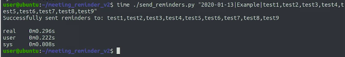
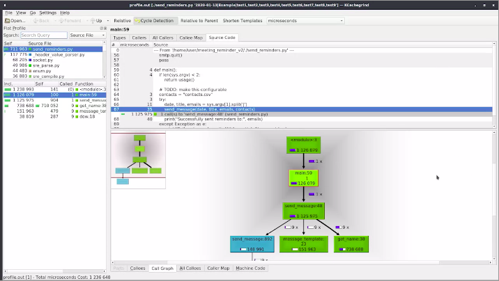
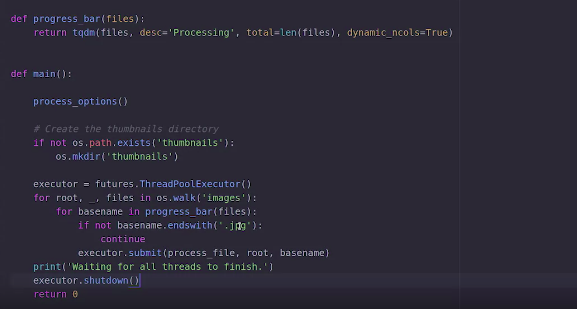

Troubleshooting and Debugging Techniques
=========================================

by Google

# Module 2
#
## Title: SLOWNESS

### Learning Objectives

* Rundown of the different reasons that can make things run slowly by
	* Looking into what causes slow scripts, slow computers, or slow systems
	* Looking into what tools are there to help identify the most common causes of slowness, and apply solutions to improve the overall performance
* There's a bunch of different things we can do if our system is too slow.
	1. Closing any applications we don't need at the moment
		* it helps us free some of the resources in our computer, like CPU time, RAM, or video memory
	1. Closing applets, plugins, extensions, or other small programs that might seem harmless, as they take some resources to run
	1. Closing browser tabs or open files in a document editor, can also help

## Understanding Slowness

### Why is my computer slow

* If you run too many applications or if one of these applications were running needs more CPU time than the fraction it's getting, things might become slow
* The general strategy for addressing slowness is to **identify the bottleneck** for addressing slowness in  device, script, or system to run slowly
* Some of the reaons could be:
	* Running out of the CPU time
	* Time spent reading data from disk waiting for data transmitted over the network
	* Moving data from disk to RAM
* If the problem is that
	1. Program needs more CPU time
		* You can close other running programs that you don't need right then
	1. You don't have enough space on disk
		* You can uninstall applications that you don't use, or delete or move data that doesn't need to be on that disk
	1. Application needs more network bandwidth
		* You can try stopping any other processes that are also using the network
	* These solutions only helps us if the issue is that there are too many processes trying to use the same resource
* Treat each part of the computer (CPU, memory, disk, newtwork bandwidth) as **finite resources**.
* Identifying the bottleneck allows us to manage the available resources more effectively
	* In order to find what is causing the bottleneck, **monitor** the usage of resources to know which of them are being exhausted
		* like CPU, the memory, the disk IO, the network connection, the graphics card
* We can use the following commands on Linux to monitor the usage of resources
	* **top** command on shows
		* Which currently running processes are using the most CPU time
		* Which currently running processes are using the most memory
		* Other load information related to the current state of the computer such as how many processes are running and how the CPU time or memory is being used
	* **iotop** command shows which processes are currently using the most disk IO usage and swap memory usage
	* **iftop** command shows which processes are currently using the most network bandwidth
* On **MacOS**, the OS ships with a tool called Activity Monitor which lets us see what's using the most CPU, memory, energy, disk, or network
* On **Windows**, there's a couple of OS tools called Resource Monitor and Performance Monitor which also let us analyze what's going on with the different resources on the computer including CPU, memory, disk and network
* Therefore, steps to diagnose what's causing the computer to run slow would be
	1. Open one of above tools to check what's going on
	2. Try to understand which resources the bottleneck and why
	3. Plan how you're going to solve the issue

### How Computer Use Resources

> A cache stores data in a form that's faster to access than its original form.

* When thinking about making things faster, it's important to understand the different speeds of the parts involved when accessing data/variables
	* ```(slowest) data from the newtok < data from disk < data from memory < data from CPU's inernal memory (fastest)```
* Create a **cache** when the same files are read from disk repeatedly by putting the same information directly into the process memory and avoid loading it from disk every time. A cache stores data in a form that's faster to access than its original form
	* Examples of caches in IT includes
		* Web proxy - It is form of cache. It stores websites, images, or videos that are accessed often by users behind the proxy
		* DNS - implements a local cache for the websites they resolve so they don't need to query from the internet every time someone asks for their IP address
		* Operating system also takes care of some caching for us. It tries to keep as much information as possible in RAM so that we can access it fast
			* This includes the contents of files or libraries that are accessed often, even if they aren't in use right now
* What happens when you run out of RAM?
	* At first, the OS will just remove from RAM anything that's cached, but not strictly necessary
	* If there's still not enough RAM after that, the operating system will put the parts of the memory that aren't currently in use onto the hard drive in a space called **swap**
	* The operating system performs **swap** when there is not enough memory - the operating system will put the parts of the memory that aren't currently in use onto the hard drive in a space called **swap**. 
		* Reading and writing from disk is much slower than reading and writing from RAM
		* So when the swapped out memory is requested by an application, it will take a while to load it back
* So what do you do if you find that your machine is slow because it's spending a lot of time swapping?
	* There are three possible reasons computer slows down due to constatnt swapping
		1. There are too many open applications
		   * Solve by closing the ones that aren't needed
		2. The available memory is too small for the amount that computer is using
		   * Solve by add more RAM to the computer
		3. One of the running programs may have a **memory leak**, causing it to take all the available memory
		   * A **memory leak** means that memory which is no longer needed is not getting released

### Possible Causes for Slowness

* When trying to figure out what's making a computer slow, below are some of the possible causes for slowness
	* The first step is to look into when the computer is slow
		* Too many applications are configured to start on a boot and the computer slows at start up
			* Solve by disabling applications that aren't really needed on a startup
	* Computer slows after days of running and the problem solved by a reboot - an application keeps some state while running and takes the memory
		* For example, this can happen if a program stores some data in memory and the data keeps growing over time, without deleting old values
			* The ideal solution for a problem like this is to change the code so that it frees up some of the memory used
			* If you don't have access to the code, another option is to schedule a regular restart to mitigate both the slow program and your computer running out of RAM
		* Solve by modifying the code to frees up the memory after using it
		* If it can't be fixed, fix by scheduling a restart
	* Computer slows after days of running and the problem isn't solved by a reboot - the files that an application handles grown too large
		* Solve by modifying the code to hanlde the large file
		* If it can't be fixed, try to **reduce** the size of the files involved - **sharding**
			* If the file is a log file, you can use a program like **logrotate** to do this
			* For other formats, you might need to write your own tool to rotate the contents
	* Only a subset of computer is slow or subset of users are affected
		* Check if there is any difference in configuration - that might be triggering the slowness
		* For example, many operating systems include a feature that tracks the files in our computer so it's easy and fast to search for them
			* This feature can be really useful when looking for something on a computer, but can get in the way of everyday use if we have tons of files and not the most powerful hardware
	* Computer slows due to a lot of reads and writes on the network-mounted file system
		* Solve by creating a cache
		* We've called out before that reading from the network is notably slower than reading from disk
		* It's common for computers in an office network to use a file system that's mounted over the network so they can share files across computers. This normally works just fine, but can make some programs really slow if they're doing a lot of reads and writes on this network-mounted file system
		* To fix this, we'll need to make sure that the directory used by the program to read and write most of its data is a directory local to the computer
	* Hardware failures
	* Malicious software

### Slow Web Server

* **Client complains about a web site loading slow**
	* First, reproduce the case and quantify the slowness with a tool called ```ab``` which stands for **Apache Benchmark** tool
	* ```ab``` checks if a website is behaving as expected or not by making a bunch of requests and summarize the results once it's done
	* Below command gets the average timing of 500 requests, and then pass site.example.com for the measurement
		```Shell
		# -n 500 --> to get the average timing of 500 requests
		ab -n 500 site.example.com
		```
		*  This tool is super useful for checking if a website is behaving as expected or not
		* It will make a bunch of requests and summarize the results once it's done
		* There are a lot more options that we could pass like 
			1. how many requests we want the program to do at the same time
			1. if the test to finish after timeout, even if not all requests completed
			* we're making 500 requests so that we can get an average of how long things are taking
	* Next, connect to the web server with ```ssh```
		```Shell
		ssh SERVERNAME
		```
	* Start by looking at the output of ```top``` and see if there's possible casue
	* For this scenario
		* ```top``` output shows that the load average is around 30
			* The load average on Linux shows how much time the processor is busy at a given minute
			* For a single core proccessor with any number above 1 and a dual core processor with any number 2 is being **overloaded**
			* 30 means that there were more processes waiting for processor time than the processor had to give
		* There are multiple ```ffmpeg``` processes running which uses all of the available CPU
			* ```ffmpeg``` program is used for video transcoding and a CPU intensive process
			<p align="center">
			  <a href="javascript:void(0)" rel="noopener">
				 </a>
			</p>
	* At this point, one thing we can try is to **change the processes priorities** so that the web server takes precedence which can be done
		* The process priorities in Linux are so that the lower the number, the higher the priority
		* Typical numbers go from 0 to 19
		* By default, processes start with a priority of zero
		* We can change process priorities with the following commands
			* ```nice``` command for starting a process with a different priority
			* ```renice``` command for changing the priority of a process that's already running
	* Since there are multiple ffmpeg proccesses running, let's change priority of all of ```ffmpeg``` at once instead of running ```renice``` one by one with the following shell script
		```Shell
		for pid in $(pidof ffmpeg); do renice 19 $pid; done
		```
	* Above shell script
		1. Iterates over the output of the ```pidof``` command with a for loop
			* ```pidof``` command receives the process name and returns all the process IDs that have that name
		2. Calls ```renice``` for each of the process IDs
			* ```renice``` takes the new priority which is 19, the lowest possible priority, as the first argument, and the process ID to change as the second one
	* Check if the problem has been solved by running ```ab```. **For this scenario, the website is still slow**
	* Transcoding processes are CPU intensive, and running them in **parallel** is overloading the computer
		* So one thing we could do is, modify the program to run the transcoding one at a time instead of all at the same time
		* To do that, we'll need to find out how these processes got started
			1. Look at the output of the ```ps``` command to get some more information about the processes
			2. Call ```ps ax``` which shows us all the running processes on the computer, and connect the output of the command to ```less``` to be able to scroll through it
				```Shell
				ps ax | less
				#search for ffmpeg from the output of ps using / which is the search key when using less
				/ffmpeg
				```
	* Upon search, it shows that
		* There are multiple ffmpeg processes that are converting videos from the webm format to the mp4 format in static
		* We don't know where these videos are on the hard drive
	* Use ```locate``` command to locate the file
		```Shell
		locate static/001.webm
		#locate command returns the following
		/srv/deploy_videos/static/001.webm
		```
	* When there are multiple files, use ```grep``` command to check if any of the files contain a call to a searching term - in this case ```ffmpeg``` instead of checking them one by one
		```Shell
		grep ffmpeg *
		```
	* The output of grep shows that ```deploy.sh``` script starts the ```ffmpeg``` processes in parallel using a tool called ```Daemonize``` that runs each program separately as if it were a daemon - address the issue
	* This might be okay if we only need to convert a couple of videos but launching one separate process for each of the videos in the static directory is **overloading** our server
	* **However, modifying the script does NOT chnage the processes that are already running**
	* **Also we want to stop these processes but not cancel them completely**, as doing so would mean that the videos being converted right now will be incomplete
	* To avoid canceling the proccesses, use the ```killall``` command with the ```-STOP``` flag which sends a stop signal but doesn't kill the processes completely
		```Shell
		killall -STOP ffmpeg
		```
	* After stopping them all, we now want to run these processes **one at a time**
		* This can be done by sending the ```CONT``` signal one by one after each proccess completes the task
		* This can be automated with the similar for loop used earlier
		```Shell
		for pid in $(pidof ffmpeg); do while kill -CONT $pid; do sleep 1; done; done;
		```
	* Check if the problem has been solved by running ```ab```. **For this scenario, the problem is fixed at this point**

## Slow Code

### Writing Efficient Code

* We should always start by writing clear code that does what it should and only try to make it faster if we realize that it's not fast enough
* As a rule, aim first to write code that is to avoid bugs
	* Readable
	* Easy to maintain
	* Easy to understand
* If the code is not fast enough, try to optimize it by eliminating **expensive actions**, which are those that take a long time to complete
	* Trying to optimize every second out of a script is probably not worth the effort though
	* **Expensive actions** are those that take a long time to complete
		* Expensive operations include 
			1. parsing a file
			1. reading data over the network
			1. iterating through a whole list
* The first step is to keep in mind that we can't really make our computer go faster
	* If we want our code to finish faster, we need to make our computer do less work, and to do this, we'll have to 
		1. Avoid doing work that isn't really needed
		2. Avoid calculating data repeatedly by using the right data structures and storing the data
		3. Reorganize the code so that the computer can stay busy while waiting for information from slow sources like disk or over the network
* Use a **profiler** tool to measure the resources that the code is using for better understanding of what's going on
	* It allows us to see 
		* which functions are called by our program
		* how many times each function was called
		* how much time are programs spent on each of them
* Because of how profilers work, they are specific to each programming language
	* C program uses **gprof** to analyze
	* Python uses **c-Profile** module to analyze

> The cProfile module is used to count how many times functions are called, and how long they run

### Using the Right Data Structures

* Using and understanding an appropriate data structures can help us avoid unnecessary expensive operations and create efficient scripts
* **Lists** are sequences of elements
	* We can
		* **Add**, **remove**, or **modify** the elements in them
		* Iterate through the whole list to operate on each of the elements
	* The structure is called **ArrayList** in Java, **Vector** in C++, **Array** in Ruby, and **Slice** in Go
	* When adding or removing elements,
		* Adding or removing elements **at the end** is fast
		* Adding or removing elements in the middle can be slow because all the elements that follow need to be repositioned
	* When accesing or finding an element,
		* Accessing an element in a specific position in the list is fast
		* Acceessing an element in an unknown position requires going through the whole list
			* This can be super slow if the list is long
* **Dictionary** store key value pairs
	* We can
		* Add data by associating a value to a key
		* Retrieve a value by looking up a specific key
	* They are called **HashMap** in Java, **Unordered Map** in C++, **Hash** in Ruby, and **Map** in Go
		* The map part in those names comes from how we're creating a mapping between a key and a value
		* The Hash part comes from the fact that to make the structure efficient, a hashing function is used internally to decide how the elements will be stored
	* The main characteristic of this structure is that it's super-fast for looking up keys
	* When accesing or finding an element,
		* Looking up keys is very fast O(n)
		* In summary,
			* If you need to access elements by position or will always iterate through all the elements, use a list
			* If we need to look up the elements using a key, use a dictionary
	* Examples where dictionary will perform better
		1. The data associated to a user which we'd look up using their username
		1. the IP associated to a computer using the host name
		1. the data associated to a product using the internal product code
* Dictionary vs List
	* Once we have our data stored in a dictionary, we can find the value associated to a key in just one operation
	* If it were stored in a list, we need to iterate through the list
* Another thing that we might want to think twice about is creating copies of the structures that we have in **memory**


### Expensive Loops

* **Loops** are an extremely useful tool and let us avoid repetitive work, but we need to use them with caution
* When using a loop, 
	* Avoid doing expensive actions inside of the loop
		* If an expensive operation is performed inside a loop, you multiply the time it takes to do the expensive operation by the amount of times you repeat the loop
	* Make sure that the list of elements that you're iterating through is only as long as you really need it to be
	* Break out of the loop once the data is found
* When you have loop in your code, make sure
	* To check what actions you're doing
	* See if there are operations you can take out of the loop to do them just once, and instead of 
		* making one network call for each element, make one call before the loop
		* reading from disk for each element, read the whole thing before the loop
	* That the list of elements that you're iterating through is only as long as you really need it to be
	* To break out of the loop once you found what you were looking for

> Always Remember : Wise Words : The right solution for one problem might not be right for a different problem

### Keeping Local Results

* If the script gets executed fairly regularly, it's common to create a local cache
* cache is a way of storing data in a form that's faster to access than its original form
* So if we're parsing a large file and only keeping a few key pieces of information from it, we can create a cache to store only that information, or if we're getting some information over the network, we can keep a local copy of the file to avoid downloading it over and over again
* Things to keep in mind
	1. We need to think about how often we're going to update the cache
		* If we're looking for some long-term stats, we can generate the cache once per day, and it won't be a problem
		* This might be the case for data like
			1. how much memory was used on computers across the fleet over the last month?
			1. How many employees each department in a company has?
			1. how many units were sold of each product over the last quarter?
		* if we're trying to look at data where the value as of right now is super important, we either can't use a cache or it has to be very short-lived
		* Sometimes, we can add a check to validate if we need to recalculate the cache or not
			* For example, if our cache is based on a file, we could store the modification date of that file when we calculated the cache
				* Then only recalculate the cache if the modification date of the file is newer than the one we had stored
	1. What happens if the data in the cache is out of date
		* Factors take we need to take in account to decide that the cache needs to be **recreated** once per **day**, once per **hour**, or even once per **minute**
			1. how often we expect the data to change
			1. how critical it is that the latest data is used
			1. how frequently the program that we're running will be executed

> Keep in mind that caches don't always need to be elaborate structures, storing lots of information with a complex timeout logic
> Sometimes, they can be as simple as having a variable that stores a temporary result instead of calculating this result every time we need it

### Slow Script with Expensive Loop

* Command used to measure the speed of script is `time`
	```Shell
	time ./send_reminder.py "2020-01-13|Example|test1"
	```
	<p align="center">
	  <a href="javascript:void(0)" rel="noopener">
		 </a>
	</p>
	* It took our script 0.129 seconds to send the email. That's not a lot but we only send the message to one user
	* There are 3 different values in output of time command
		1. real
			* Real is the amount of actual time that it took to execute the command
			* This value is sometimes called wall-clock time because it's how much time a clock hanging on the wall would measure no matter what the computer's doing
		1. user
			* User is the time spent doing operations in the user space
		1. sys
			* Sys is the time spent doing system level operations
	* The values of user and sys won't necessarily add up to the value of real because the computer might be busy with other processes
	* Perform the same test with 9 test users to check the time it took to execute
		```Shell
		time ./send_reminder.py "2020-01-13|Example|test1,test2,test3,test4,test5,test6,test7,test8,test9"
		```
		<p align="center">
		  <a href="javascript:void(0)" rel="noopener">
			 </a>
		</p>
		* It took 0.296 seconds to send the email this time. That's still not a lot but it does look like it's taking longer with a longer list of emails
* We will use **profiler** known as **pprofile3** to find any expensive operations that we can improve
	```bash
	# -o profile.out --> to store the output in profile.out file
	# -f callgrind --> We will use call grind file format 
	pprofile3 -f callgrind -o profile.out ./send_reminder.py "2020-01-13|Example|test1,test2,test3,test4,test5,test6,test7,test8,test9"
	```
	* This generated a file that we can open with any tool that supports the call grand format
	* We will use **kcachegrind** to look at the content of the file generated
		* **kcachegrind** is GUI tool for looking these files
		```bash
		kcachegrind profile.out
		```
		<p align="center">
		  <a href="javascript:void(0)" rel="noopener">
			 </a>
		</p>
		<p align="center">
		  <a href="javascript:void(0)" rel="noopener">
			 </a>
		</p>
		* Call Graph, tells us
			1. the main function is calling the send message function one time
			1. Send Message function is calling the message template function, the get name function, and the send message function nine times each
			1. The graph also tells us how many microseconds are spent on each of these calls
				* We can see that most of the time is being spent in the get name function

> We can precede the name of our commands and scripts with the "time" shell builtin and the shell will output execution time statistics when they complete.
#
> The kcachegrind tool is used for profile data visualization that, if we can insert some code into the program, can tell us how long execution of each function takes
#
> cProfile provides deterministic profiling of Python programs, including how often and for how long various parts of the program executed
#
> Lists are efficient, and if we are either iterating through the entire list or are accessing elements by their position, lists are the way to go
#
> Loops that run indefinitely, and include subtasks to complete before moving on can be very expensive for most automation tasks
#
> Using a dictionary is faster to look up elements than going through a list

## When Slowness Problem Get Complex

### Parallelizing Operations

> Reading information from disk or transferring it over the network is a slow operation
In typical scripts while this operation is going on, nothing else happens
The script is blocked, waiting for input or output while the CPU sits idle
One way we can make this better is to do operations in parallel
That way, while the computer is waiting for the slow IO, other work can take place

* Our OS handles the many processes that run on our computer
	* If a computer has more than one core, the operating system can decide which processes get executed on which core, and no matter the split between cores, all of these processes will be executing in parallel
		* Each of them has its own memory allocation and does its own IO calls
	* The OS will decide what fraction of CPU time each process gets and switch between them as needed
* Operatiing in **parallel** is one way to run scripts more efficiently
	* **Concurrency** is dedicated to how we write programs that do operations in parallel
* When data needs to shared while using the OS to split the work and the processes, use **threads**
	* These processes don't share any memory by default
* __Threads let us run parallel tasks inside a process__
	* This allows threads to share some of the memory with other threads in the same process
* To handle threads, modify the code to create and handle the thread
	* In Python, use the **Threading** or **AsyncIO** modules (each programming language has different implementations)
		* These modules let us specify which parts of the code we want to run in separate threads or as separate asynchronous events, and how we want the results of each to be combined in the end
* One thing to watch out for is that depending on the actual threading implementation for the language you're using, it might happen that all threads get executed in the same CPU processor
* If your script is mostly just waiting on input or output, also known as I/O bound, it might matter if it's executed on one processor or eight
* When doing operations in parallel, we need to find the right balance of simultaneous actions that let our computers stay busy without starving our system for resources
	* For Example,
		* If we're trying to read a bunch of files from disk and do too many operations in parallel, the disk might end up spending more time going from one position to another then actually retrieving the data
		* if we're doing a ton of operations that use a lot of CPU, the OS could spend more time switching between them than actually making progress in the calculations we're trying to do

### Slowly Growing in Complexity

* **memcached** is a caching service, which keeps the most commonly used results in RAM to avoid querying the database unnecessarily
* **Varnish** is an HTTP accelerator designed for content-heavy dynamic web sites as well as APIs. In contrast to other web accelerators, such as **Squid**, which began life as a client-side cache, or **Apache** and **nginx**, which are primarily origin servers
	* **Varnish** was designed as an HTTP accelerator

### Dealing with Complex Slow Systems

> Systems that grow in usage also grow in complexity.

* In large complex systems, we have lots of different computers involved
	* The web server is the part of the system that directly interacts with external users
	* Another component is the database server, which is accessed by the code that handles any requests generated from the website
	* Depending on how the whole system is built, you might have a bunch of other services involved doing different parts of the work
		1. There could be a billing system that generates invoices once orders are placed.
		1. A fulfillment system used by the employees preparing the orders for customers
		1. A reporting system that once a day creates a report of all the sales placed and possibly more
	* On top of this, you should probably have backup, monitoring, testing infrastructure, and so on
* What do you do if your complex system is slow? As usual, what you want to do is find the **bottleneck** that's causing your infrastructure to underperform
	* Is it the generation of dynamic pages on the web server?
	* Is it the queries to the database?
	* Is it doing the calculations for the fulfillment process?
* **Key piece is to have a good monitoring infrastructure that lets you know where the system is spending the most time**
* When a database server needs to find data, it can do it much faster if there's an **index** on the field that you're querying for
* On the flip side, if the database has too many indexes, adding or modifying entries can become really slow because all of the indexes need updating

### Using Threads to Make Things Go Faster

> The **futures** module makes it possible to run operations in parallel using different executors

* **futures** sub module, which is part of the **concurrent module** - This gives us a very simple way of using Python threads
	```python
	from concurrent import futures
	```
* **Executer** - This is the process that's in charge of distributing the work among the different workers
* The futures module provides a couple of different executors
	1. Using threads
	1. Using processes
* An interesting thing that happens when we use threads is that the loop will finish as soon as all tasks are scheduled. But it will still take a while until the tasks complete
	<p align="center">
	  <a href="javascript:void(0)" rel="noopener">
		 </a>
	</p>
* Processes work faster than Threads in python:
	* This is because, by using processes, we're making even more use of the CPU
	* The difference is caused by the way threads and processes work in Python
		* Threads use a bunch of safety features to avoid having two threads that try to write to the same variable
			* This means that when using threads, they may end up waiting for their turn to write to variables for a few milliseconds, adding up to the small difference between the two approaches
