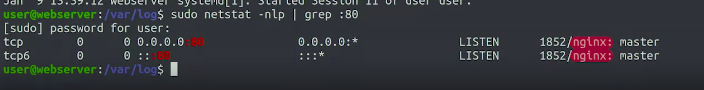
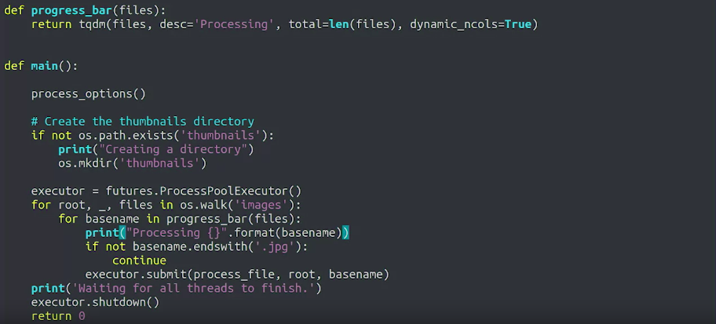
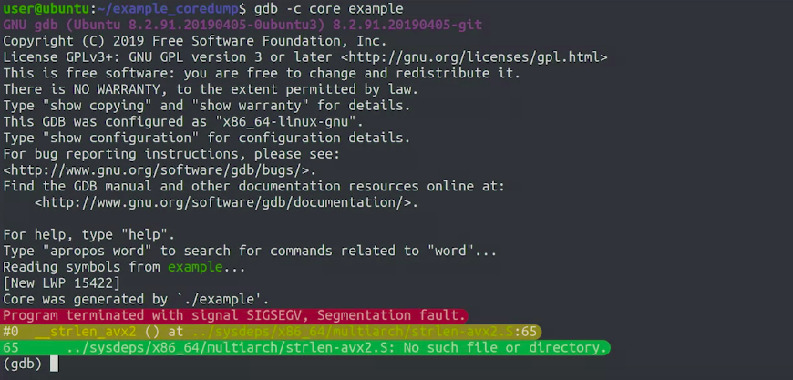
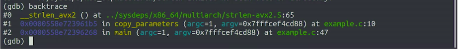
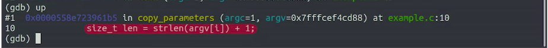
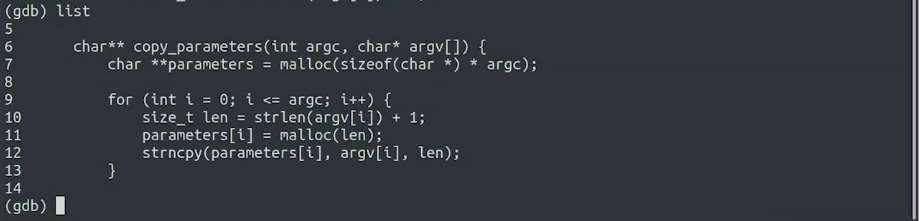
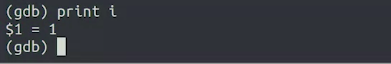
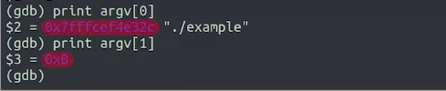
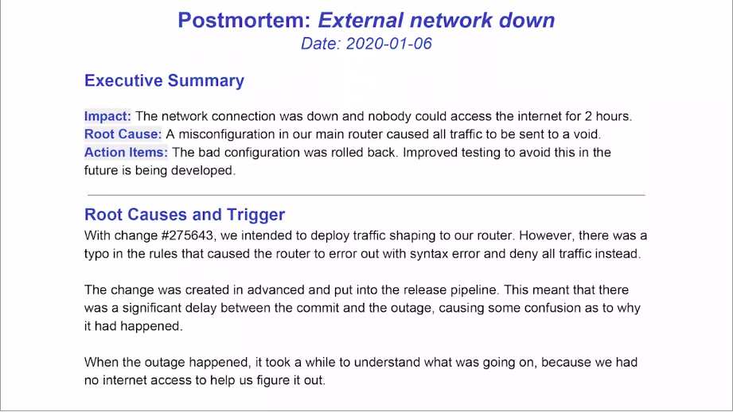

Troubleshooting and Debugging Techniques
=========================================

by Google

# Module 3
#
## Title: CRASHING PROGRAMS

## Why Programs Crash

### Systems That Crash

* Reduce the scope of the problem by starting with the actions that are easier and faster to check
	1. Try looking at the logs to see if there's any error that may point to what's happening
		* So you check if the user can reproduce the problem by doing this same action on a different computer
			* You ask the user to try this out, and it turns out on a different machine that can generate the invoice just fine
				* So that means that the problem just has to do with the installation or configuration on that specific computer
	2. Try moving away the local configuration for the program and using the default configuration/reinstall the application
	3. Try checking if it is some hardware component failure
* To check the health of our RAM, we can use the **memtest86** tool to look for errors
	* We run this tool on boot instead of the normal operating system so that it can access all of the available memory and verify if the data written to memory is the same when it tries to read it back

### Understanding Crashing Applications

* To look at logs on 
	* **Linux** - `/var/log/syslog`
	* **Mac** OS - We generally use the Console App to look at logs
	* **Windows** - Event Viewer app to look at logs
* We can use Debug Logging - By enabling this extra logging information, we can get a better idea of what's actually causing the problem
	* Debug Logging can be done by
		* We might need to enable it from a setting in the applications configuration file
		* A command line parameter to pass when running the application manually
	* To do this we can use following tools, on 
		* **Linux** - we use `strace`
		* **Mac** OS - we use `dtruss` 
		* **Windows** - we use `Process Monitor`
	* By tracing which system calls a program is doing we can see what files and directories it's trying open what network connections it's trying to make and what information it's trying to read or write
		* This can give us a better idea of what caused the actual problem
* In the system log we can check which programs and libraries were recently updated
* When we're trying to debug an application that crashes finding a reproduction case can help us both understand what's causing the crash and figure out what we can do to fix it
	* So it's valuable to spend some time figuring out the state that triggers the crash
	* This includes 
		* the overall system environment 
		* the specific application configuration 
		* the inputs to the application 
		* the outputs generated by the application 
		* the resources that uses
		* the services it communicates with

> To find the **root cause** of a crashing application will want to look at all available logs, figure out what changed, trace the system or library calls the program makes, and create the smallest possible reproduction case

### What to do when you can't fix the program?

* **Wrapper**
	* A Wrapper is a function or program that provides a compatibility layer between two functions or programs so they can work well together
	* Using Wrappers is a pretty common technique when the expected output and input formats don't match
* **Watchdog**
	* This is a process that checks whether a program is running and when it's not starts the program again
	* To implement this, we need to write a script that stays running in the background and periodically checks if the other program is running
		* Whenever the check fails the watchdog will trigger the program to restart
* A **container** allows the application to run in its own environment without interfering with the rest of the system
* Questions you need to mentioned while making reproduction case
	1. What were you trying to do?
	1. What were the steps you followed?
	1. What did you expect to happen?
	1. What was the actual outcome?

### Internal Server Error

> The `/etc` directory will contain the application folder that stores configuration files

* When a webpage on a Web server isn't working
	1. First Step: Try looking at logs
	    * On Linux systems, logs are located in `/var/log/`
	    * Use the date command to check the current date
	1. Use the **netstat** command which can give us information about our network connections depending on the flags passed
	    * This command accesses different sockets that are restricted to route the administrator user on Linux - call it with **sudo**
	    	* Run commands as root, and then pass different flags with **netstat**
	    * Use `-n` to print numerical addresses instead of resolving host names
	    * Use `l` to only check out the sockets that are listening for connection
	    * Use `p` to print the process ID and name to which each socket belongs
	    * Since we are interested in **port 80**, connect the output to a **grep** command checking for **:80**
	    	- the Web server is usually running on **port 80**, the default web serving port
	    	```Shell
	    	sudo netstat -nlp | grep :80
	    	```
	    	<p align="center">
			  <a href="javascript:void(0)" rel="noopener">
				 </a>
			</p>
* **Configuration** files on Linux are stored in the etc directory
* **uWSGI** is a common solution used to connect a Web server to programs that generate dynamic pages
	* **uWSGI** is a deployment option on servers like **nginx**, **lighttpd**, and **cherokee**
* **bottle** which is a Python module to generate dynamic web pages


> memtest86 and memtest86+ are memory analysis software programs designed to test and stress test the random access memory of an x86 architecture system for errors, by writing test patterns to most memory addresses, then reading data back and checking for errors.
#
> The first step is identifying the root cause of the problem. Resource monitors such as Activity Monitor (MacOS), top (Linux and MacOS) or Resource Monitor (Windows) can help us identify whether our bottleneck is CPU-based or memory-based

## Code that Crashes

### Accessing Invalid Memory

> **Dr. Memory** can assist in finding out if invalid operations are occurring in a program running on **Windows** or **Linux**

* The OS keeps a mapping table of which process is assigned which portion of the memory
* Processes aren't allowed to read or write outside of the portions of memory they were assigned
* One common reason a program crashes is it's trying to access **invalid memory**
	* Accessing invalid memory means that the process tried to access a portion of the system's memory that wasn't assigned to it
* In low-level languages like **C** or **C++**, the variables that store memory addresses are called **pointers** and the programmer needs to take care of requesting the memory that the program is going to use and then giving that memory back once it's not needed anymore
	* Pointers are just like any other variable and code that can be modified as needed
	* When a program tries to read or write to a memory address outside of the valid range, in this case OS will raise an error like **segmentation fault** or **general protection fault**
* Common programming errors that lead to segmentation faults or segfaults include
	* Forgetting to initialize a variable
	* Trying to access a list element outside of the valid range
	* Trying to use a portion of memory after having given it back
	* Trying to write more data than the requested portion of memory can hold
* The **debugger** can give you a lot more detail on what the application is doing and why the memories invalid
	* For this to be possible, we'll need our program to be compiled with debugging symbols
		* This means that on top of the information that the computer uses to execute the program, the executable binary needs to include extra information needed for debugging, like the names of the variables and functions being used
			* These symbols are usually stripped away from the binaries that we run to make them smaller
* Debugger can give you alot of information 
	* The function where the fault happened
		* You'll know the parameters that the function received and find out the address that was invalid
	* Certain variable is being initialized to late
	* The code is trying to read too many items on a list
	* The **debugger** can give you a lot more detail on what the application is doing and why the memories invalid
* Linux distributions like **Debian** or **Ubuntu** ships separate packages with the **debugging symbols** for all the packages in the distribution
* **Microsoft compilers** can also generate **debugging symbols** in a separate **PDB file**
	* Some Windows software providers let users download the PDP files that correspond to their binaries to let them properly debug failures
* **Undefined Behavior** - the code is doing something that's not valid in the programming language
	* The actual outcome will depend on the compiler used, how the operating system assigns memory to processes, and even the version of the libraries in use
	* A program that runs fine on a computer running Windows trigger a **segfault** on a computer running Linux and vice versa
* **Valgrind** can help when trying to understand problems related to handling invalid memory
	* Valgrind is a very powerful tool that can tell us if the code is doing any invalid operations no matter if it crashes are not
	* Valgrind lets us know 
		* If the code is accessing variables before initializing them
		* If the code is failing to free some of the memory requested
		* if the pointers are pointing to an invalid memory address, etc...
	* Valgrind is available on **Linux** and **Mac OS**, and **Dr. Memory** is a similar tool that can be used on both **Windows** and **Linux**
* In **high-level languages like Python**, the **interpreter** will almost certainly catch these problems itself
	* It will then throw an exception instead of letting the **invalid memory access** reach the operating system

### Unhandled Errors and Exceptions

* When a program comes across an unexpected condition that isn't correctly handled in the code, it will trigger errors or exceptions
* In **Python**
	* Following errors could occurs
		* **Index error** if we tried to access an element after the end of a list
		* **Type error** or an **attribute error** if we try to take an action on a variable that wasn't properly initialized
		* **Division by zero error** if we tried to divide by zero
	* When the code generates one of these errors without handling it properly, the program will finish unexpectedly
* In general
	* Unhandled errors happen because
		* the codes making wrong assumptions
		* the program's trying to access a resource that's not present
		* the code assumes that the user will enter a value but the user entered and empty string instead
		* maybe the application is trying to convert a value from one format to another and the value doesn't match the initial expectations
	* When these failures happen, the interpreter that's running the program will print the following
		* Type of error
		* Line that caused the failure
		* The **traceback**
			* **Traceback** shows the lines of the different functions that were being executed when the problem happened
			* In lots/most of cases, the error message and traceback info already gives us enough to understand what's going on, and we can move on to solving the problem
* When error messages are not enough to debug, then in that case we need to find out where things are going wrong, we use **debugging tools** available for the application's language
	* For a Python, program we can use the **BDB interactive debugger** which lets us do all the typical debugging actions like 
		* executing lines of code one-by-one
		* looking at how the variables change values
	* When we're trying to understand what's up with a misbehaving function on top of using debuggers
		* It's common practice to add statements that **print** data related to the codes execution
			* Statements like these could show the 
				1. contents of variables
				1. the return values of functions
				1. metadata like the length of a list or size of a file
			* This technique is called **printf debugging**
				* The name comes from the **printf** function used to print messages to the screen in the **C programming language**
					* We can use this technique in all languages, no matter if we use **print**, **puts**, or **echo** to display the text on the screen
				* It adds statements that print data related to the codes execution to show the contents of variables, the return values of functions or metadata like the length of a list or size of a file
				* Taking a step further, the best approach is to add the messages in a way that can be easily enabled or disabled depending on whether we want the debug info or not
				<p align="center">
				  <a href="javascript:void(0)" rel="noopener">
					 </a>
				</p>
* In Python, use the **logging module** which lets us set how comprehensive we want our code to be
	* We can say whether we want to include all debug messages, or only info warning or error messages
	* Then when printing the message, we specify what type of message we're printing
	* That way, we can change the debug level with a flag or configuration setting
* What to do once you have identified the problem/issue
	* The solution might be fixing the programming error like 
		1. making sure variables are initialized before they're used
		1. that the code doesn't try to access elements after the end of a list
		1. that certain use cases that hadn't been considered needs to be added to the code
* Our aim is to make the program more resilient to failures
	* Instead of crashing unexpectedly, you want the program to inform the user of the problem and tell them what they need to do

### Fixing Someone Else's Code

* Writing good comments is one of those good habits that pays off when trying to understand code written by others and also your past self
	* Unfortunately, a lot of code doesn't include enough comments, leaving us to try to understand it without enough context
		* If that's the case, you can improve things by adding comments as you read the code and figure out what it's doing
		* Writing these comments help you solidify your understanding
		* If you contribute those comments back to the original developers, you can help anybody else trying to understand the code
* Another thing that can help to understand someone else's code is reading the tests associated to the code
	* Well-written tests can tell us what each function is expected to do
	* Looking at the existing tests can show us which use cases weren't taken into account
	* But what if there aren't enough tests?
		* Just like with writing extra comments, writing some tests of your own can help you better see what the code is supposed to do and improve overall quality of the code
		* This can also be really useful when modifying the original code

### Debugging a Segmentation Fault

> The `backtrace` command can be used to show a summary of the function calls that were used to the point where the failure occurs

* When an application crashes, it's useful to have a **core file** of the crash
* **Core files** store all the information related to the crash so that we or someone else can debug what's going on
	* It's like taking a snapshot of the crash when it happens to analyze it later
* In order to enable OS to generate core file
	1. Run the `ulimit` command
	1. Use the `-c` flat for core files
	1. use the unlimited to state that we want core files of any size
	```Shell
	ulimit -c unlimited
	```
* For the exercise show in the video, it debugs **off-by-one error** by
	1. Generated a core file and check the file using `ls -l` command
		* This file contains all the information of what was going on with the program when it crashed
	1. We can use core file to understand why the program crashed by passing it to the **GDB debugger**
		* Use `gdb -c core` to give it a core file and then example to tell it where the executable that crashed is located
		```Shell
		gdb -c core example
		```
		* When it starts, GDB shows a bunch of messages including its
			1. version
			1. license
			1. how to get help
			<p align="center">
			  <a href="javascript:void(0)" rel="noopener">
				 </a>
			</p>
	1. Use the `backtrace` command to look at the full backtrace of the crash
		```Shell
		(gbd) backtrace
		```
		<p align="center">
		  <a href="javascript:void(0)" rel="noopener">
			 </a>
		</p>
		* The first element in the list is the function where the crash occurred
		* The second element is the function that called the function and so on
	1. We can use `up` command to move the calling function in `backtrace` and check out the line and copy parameters that caused the crash
		```Shell
		(gbd) up
		```
		<p align="center">
		  <a href="javascript:void(0)" rel="noopener">
			 </a>
		</p>
	1. Use the `list` command that shows the lines around the current one to get more contexts for the code that failed
		```Shell
		(gbd) list
		```
		<p align="center">
		  <a href="javascript:void(0)" rel="noopener">
			 </a>
		</p>
	1. Use the `print` command to print the contents of variables used in program
		* GDB uses the **dollar sign** `$` followed by a **number** to give separate identifiers to each result it prints
		    ```Shell
			(gbd) print i
			```
			<p align="center">
			  <a href="javascript:void(0)" rel="noopener">
				 </a>
			</p>
	    * Hexadecimal numbers are used to show addresses in memory where some data is stored
	    * Print the contents of the first element argv 0, and then the second element argv 1, since argv is being to assign values in code
	    	```Shell
	    	## Check the Output of these statements in image below
			(gbd) print argv[0]
			(gbd) print argv[1]
			```
			<p align="center">
			  <a href="javascript:void(0)" rel="noopener">
				 </a>
			</p>
				* **GDB** is telling us that the first element in the argv array is a pointer pointing to the `./example` string
				* The second element is a pointer to zero also known as a **null pointer**
					* **Zero** is never a valid pointer
						* It usually signals the end of data structures in C
					* That is our code is trying to access the second element in the array, but the array only has one valid element
						* In other words, the for loop is doing one iteration to many
						* This is known as an **off-by-one error**, and it's a super common error
							* Fix for this issue would be to change the less than or equal sign to be a strictly less than sign so that the iteration stops one element before

### Debugging a Python Crash

* **Byte Order Mark** or **BOM** which is used in **UTF-16** to tell the difference between a file stored using Little-endian and Big-endian
* **UTF-8-sig** - Setting this encoding means that Python will get rid of the BOM when files include it and behave as usual when they don't

> In **pdb3** debugger, we can use **continue** command can you use to run the program until it crashes with an errors or finishes
#
> In debuggers, **watchpoint** that letter code run until a variable or expression changes
#
> In debuggers, **breakpoint** that letter code run until certain line of code is executed 

#### Review

* **Printf debugging** originated in name with using the **printf()** command in **C++** to display debug information, and the name stuck
	* This type of debugging is useful in all languages
* **Core files** (or **core dump files**) record an image and status of a running process, and can be used to determine the cause of a crash
* The **Off-by-one bug**, often abbreviated as **OB1**, frequently happens in computer programming when an iterative process iterates one time too many or too little
* Following are likely to cause a **segmentation fault**
	1. Wild pointers
	1. Reading past the end of an array
	1. Stack overflow
* In debuggers, **breakpoint** that letter code run until certain line of code is executed 
* In debuggers, **watchpoint** that letter code run until a variable or expression changes

#### Resources for Debugging Crashes

* Readable Python code on GitHub
	1. [**Minecraft Git Code**](https://github.com/fogleman/Minecraft)
	1. [**cherrypy Git Code**](https://github.com/cherrypy/cherrypy)
	1. [**flask Git Code**](https://github.com/pallets/flask)
	1. [**tornado Git Code**](https://github.com/tornadoweb/tornado)
	1. [**howdoi Git Code**](https://github.com/gleitz/howdoi)
	1. [**bottle Git Code**](https://github.com/bottlepy/bottle/blob/master/bottle.py)
	1. [**sqlalchemy Git Code**](https://github.com/sqlalchemy/sqlalchemy)


## Handling Bigger Incidents

### Crashes in Complex Systems

> **Q:** A website is producing service errors when loading certain pages. Looking at the logs, one of three web servers isn’t responding correctly to requests. What can you do to restore services, while troubleshooting further?
> **A:** Remove the server from the pool
	Removing the server from the pool will provide full service to users from the remaining web servers

* Troubleshoot strategies that can be used when handling crashes in complex systems
	1. Roll back
		* It is the best strategy to use when the new changes are supsected to be causing the issue
		* It restores the service back to health if it was the cause
		* It helps eliminate new change as a possible cause, if doing the rollback doesn't help
	1. Logs with useful information
		* Check the log messages in the servers providing the service, and see if you find any additional information pointing to what's causing the issue
		* Find any log specific to the service that's failing, and also look at the general system logs to see if there's a problem affecting the server in general
	1. Monitoring of what the service is doing and use version control (VCS) for all changes, for qucik roll back if needed
	1. Deploy new machines if needed
		* This could be achieved by either keeping standby servers, in case you need to use them, or by having a tested pipeline that allows you to deploy new servers on demand
		* When the servers are running as virtual machines, especially if they're running in the cloud, is that there might be external limits apply to these services.
			* Resources might be artificially capped, like
				1. available CPU time
				1. RAM
				1. network bandwidth
			* The use of certain external services can also be limited, like 
				1. how many database connections you can have at the same time
				1. how much data you can store
* Error messages generated in application or system should have detailed information regarding the issue
* Having good logs is essential to understanding what's going on

### Communication and Documentation During Incidents

* When working on a problem, it's always a good idea to document what you're doing in a bug or ticket
	* If you don't write down what you've tried or how you fix the problem, you risk for getting some important details and wasting a lot of valuable time when you need to revisit an issue
	* If there's no such system at your company, then use 
		1. a doc
		1. a text file
		1. Wiki
	* Documenting what you do, lets you keep track of what you've tried and what the results were
		* This might seem unnecessary
			* But after a whole day of troubleshooting a problem, it's pretty common for us to forget what we've tried or what was the outcome of a specific action
			* On top of that, having all this info available in some electronic forum lets you easily share all the data you've collected with other team members
* Forgetting to document could
	* Risk forgetting some important details
	* Wasting a lot of valuable time when the same issue is revisited
* Good document should contain the following
	* Root cause
		* How you diagnose the problem and found that root cause
	* What you did to fix the issue
	* What needs to be done to prevent the problem from happening again
* The **Incident Commander** or **Incident Controller** needs to look at the big picture and decide what's the best use of the available resources --> This is effective when there's a large incident and there's a big team working on figuring out the solution
	* Person in charge of delegating the different tasks to the team members
	* They can make sure that there's no duplication of work among team members and that only one person is modifying the production system at a time
	* Having multiple people make overlapping changes to the system could lead to confusing results, making the outage even longer
* The **Communications lead** provides timely updates on the incident and answers questions from users

### Writing Effective Postmortems

* **Postmortems** are documents that describe details of incidence to help us learn from our mistakes
	* The goal of postmortems is to learn from what happened to prevent the same issue from happening again (and not to blame anyone)
* In general **postmortem** should inclde include
	* Details of what caused the issue
	* What the impact of the issue was
	* How it got diagnosed
	* Short-term remediation you applied
	* Long-term remediation you recommend
* **Postmortems** are super useful with **large incidents**
* Sample Postmortem report
	<p align="center">
	  <a href="javascript:void(0)" rel="noopener">
		 </a>
	</p>
	<p align="center">
	  <a href="javascript:void(0)" rel="noopener">
		 </a>
	</p>

#
> Virtualization makes deployment of VM servers in the cloud a fast and relatively simple process
#
> Automatically deploying additional servers to handle the loads of requests during peak hours can resolve issues with a complex set of servers
#
> A postmortem is a detailed document of an issue which includes the root cause and remediation. It is effective on large, complex issues

