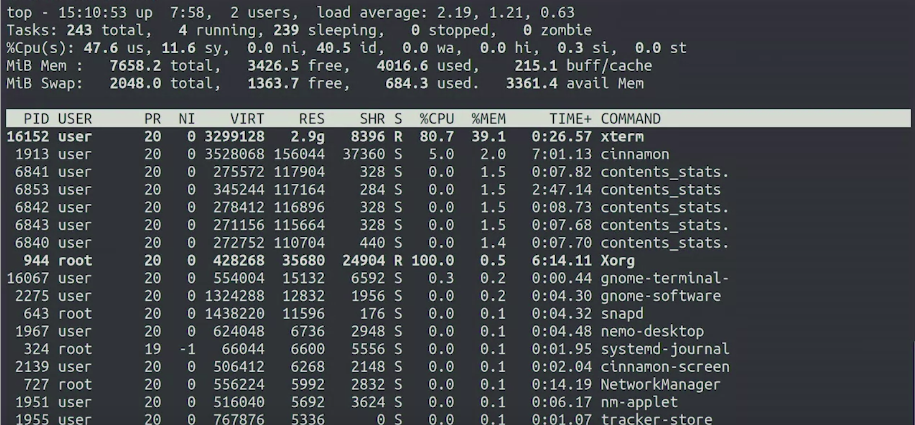
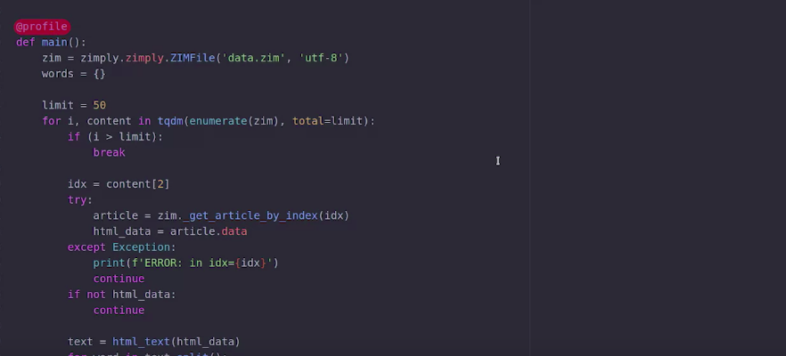
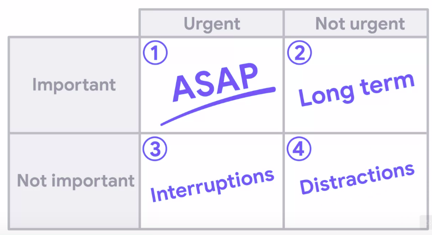

Troubleshooting and Debugging Techniques
=========================================

by Google

# Module 4
#
## Title: MANAGING RESOURCES

## Managing Computer Resources

### Memory Leaks and How to Prevent Them

> An application that still needs a lot of memory, even after a restart, most likely points to a memory leak

* Most applications need to store data in memory to run successfully
* Processes interact with the OS to request chunks of memory, and then release them when they're no longer needed
	* When writing programs in languages like **C, or **C++**, the programmer is in charge of deciding how much memory to request, and when to give it back
* A **Memory Leak**, happens when a chunk of memory that's no longer needed is not released
	* If the memory leak is small, we might not even notice it, and it probably won't cause any problems
	* when the memory that's leaked becomes larger and larger over time, it can cause the whole system to start misbehaving
* When a program uses a lot of RAM, other programs will need to be swapped out and everything will run slowly
	* If the program uses all of the available memory, then no processes will be able to request more memory, and things will start failing in weird ways
		* When this happens, the OS might terminate processes to free up some of the memory, causing unrelated programs to crash
* How languages manage and request memory
	1. They request the necessary memory when we create variables, and then they run a tool called **Garbage Collector** to release memory
		* **Garbage Collector** - is in charge of freeing the memory that's no longer in use
			* To detect when memory is no longer in use, the **garbage collector** looks at the variables in use and the memory assigned to them and then checks if there any portions of the memory that aren't being referenced by any variables
			* When our code keeps variables pointing to the data in memory, like a variable in the code itself, or an element in a list or a dictionary, the garbage collector won't release that memory
				* In other words, even when the language takes care of requesting and releasing the memory for us, we could still see the same effects of a memory leak
* The OS will normally released any memory assigned to a process once the process finishes
	* So memory leaks are less of an issue for programs that are **short lived**
		* but can become especially problematic for **processes** that keep **running** in the **background**
	* Even **worse** than these, are memory leaks caused by a **device driver**, or the **OS** itself
		* In these cases, only a **full restart of the system** releases the memory
* We can use a **memory profiler** to figure out how the memory is being used
	* For profiling **C and **C++** programs, we'll use **Valgrind**
	* For profiling a **Python**, there are bunch of different tools that are disposal, depending on what exactly we want to profile
* Using profilers, we can see what structures are using the most memory at one in time or take snapshots at different points in time and compare them
	* The goal of these tools is to help us identify which information we're keeping in memory that we don't actually need
* It's important that we measure the use of memory first before we try to change anything, otherwise we might be optimizing the wrong piece of code

### Managing Disk Space

* Programs may need disk space for lots of different reasons
	1. Installed binaries and libraries
	1. data stored by the applications
	1. cached information
	1. logs
	1. temporary files
	1. even backups
* If we are facing memory issues maybe we
	1. Are trying to store too much data in too little space
	1. Have many applications installed
	1. Are trying to store too many large files in the drive
* A full hard drive might 
	* Lead to data loss, as some programs might truncate a file before writing an updated version of it, and then fail to write the new content, losing all the data that was stored in it before
	* Programs may suddenly crash, while trying to write something into disk and finding out that they can't
* Large temporary files may remain if an application crashes because it’s not cleaned up automatically

### Network Saturation

* The two most important factors that determine the time it takes to get the data over the network are 
	1. **Latency**
		* The **latency** is the delay between sending a byte of data from one point and receiving it on the other
		* This value is directly affected by the physical distance between the two points and how many intermediate devices there are between them
	1. Bandwidth of the connection
		* The **bandwidth** is how much data can be sent or received in a second
		* This is effectively the data capacity of the connection
			* Internet connections are usually sold by the amount of bandwidth the customer will see
		* It's important to know that the usable bandwidth to transmit data to and from a network service will be determined by the available bandwidth at each endpoint and every hop between them
* If you're transmitting a lot of small pieces of data, you care more about latency than bandwidth
	* In this case, you want to make sure that the server is as close as possible to the users of the service, aiming for a latency of less than 50 milliseconds if possible, and up to a 100 milliseconds in the worst-case
* If you're transmitting large chunks of data, you care more about the bandwidth than the latency
	* In this case, you want to have as much bandwidth available as possible regardless of where the server is hosted
* What do we mean by bandwidth available?
	* Computers can transmit data to and from many different points of the Internet at the same time, but all those separate connections share the same bandwidth
		* Each connection will get a portion of the bandwidth, but the split isn't necessarily even
		* If one connection is transmitting a lot of data, there may be no bandwidth left for the other connections
			* In such cases, the **latency** can increase a lot because packets might get held back until there's enough **bandwidth** to send them
* To check out which processes are using the network connection by running a program like `iftop`
	* This shows how much data each active connection is sending over the network
* The more users sharing the same network, the slower the data comes in
	* This is true for home connections and office connections alike
* **Traffic Shaping** is a way of marking the data packets sent over the network with different priorities, to avoid having huge chunks of data, use all the bandwidth
	* Prioritizing, processes that send and receive small packets can keep working fine, while processes that need the most bandwidth can use the rest
	* There's also a limit to how many network connections can be established on a single computer/server
		* Issues that might cause issue and stop new network connections
			1. Software that causes it to open way too many connections
			1. Keep old connections open even if they're no longer in use

### Dealing with Memory Leaks

* `uxterm` terminal is used to create out-of-memory scenario or you can say memory leak case
* The **Scroll Buffer** is that nifty feature that lets us scroll up and see the things that we executed and their output
	* The contents of the buffer are kept in memory. So if we make it really long and we managed to fill it, will cause our computer to run out of memory
* We run a command like `od-cx/dev/urandom`
	* This command will take the random numbers generated by the urandom device and show them as both characters and hexadecimal numbers
	* the urandom device keeps giving more and more random numbers, it will just keep going. Our command is filling up the scroll buffer, making a computer require more and more memory
	* We will use `top` command to memory usage
		* Pressing `Shift + M` we tell ton that we want to order the programs by how much memory they are using
			

			  
			

* In output of `top` command
	1. The column labeled **RES** is the dynamic memory that's preserved for the specific process
	1. The one labeled **SHR** is for memory that's shared across processes
	1. The one labeled **VIRT** lists all the virtual memory allocated for each process
		* This includes
			1. process specific memory
			1. shared memory
			1. other shared resources that are stored on disk but maps into the memory of the process
* It's usually fine for a process to have a high value in the **VIRT** column. The one that usually indicates a problem is the **RES** column
* Looking at the output of `top` and comparing it to what it used to be a while back is usually how any investigation into a memory leak starts
* **memory profiler** - This is one of the many different memory profilers available for Python
* **Decorator** is used in Python to add extra behavior to functions without having to modify the code
	

	  
	

* The memory profiler gives us information about which lines are adding or removing data from the memory used by the program
	1. The first column shows us the amount of memory required when each line gets executed.
	1. The second one shows the increase in memory for each specific line
		

		  
		

		* We see here that after going through 50 articles, the program already took 130 megabytes, no wonder system ran out of memory when trying to process all the articles

#### Review 
1. Sometimes a file is marked as deleted right after it is opened, so the program doesn't "forget" later.
	* The file is then written to, but we can't see this as the file is already marked as deleted, but will not actually be deleted until the process is finished
1. The `top` command will show us all running processes and their memory usage in Linux
1. Latency is a measure of the time it takes for a request to reach its destination
1. Traffic shaping can mark data packets and assign higher priorities when being sent over the network
1. Guppy is a Python library with tools to profile an entire Python application

## Managing Our Time

### Getting to the Important Tasks

* One super effective way to manage time, when working in IT is the **Eisenhower Decision Matrix**
	* When using this method, we split tasks into two different categories
		1. urgent
		1. important
	* There are tasks that are **important** and **urgent**. Draw alarm bells around them if you'd like because these need to be done right away
		* For example, if the company's Internet connection is down, it's both urgent and important to get it back up as soon as possible
	* Some tasks are **important**, but **not urgent**, so they need to get done at some point even if it takes a while to complete them
		* For example, as a follow-up to the network being down, it would be important to make sure that there's a backup network connection so that if the existing one is ever down again, the company can stay connected using the backup
	* Other tasks might **seem urgent**, but **aren't** really **important**
		* A lot of the interruptions that we need to deal with are in this category
			1. Answering email
			1. phone calls
			1. texts
			1. instant messages
	* There's a whole category of tasks that are **neither important nor urgent**
		* These are distractions and time wasters, they shouldn't be done at all
		* These include
			1. meetings where nothing useful is being discussed
			1. email threads that lead to nowhere
			1. office gossip
			1. any other tasks that eat up our time without giving anything valuable in return
				

				  
				

* Examples of tasks which are Important but not Urgent
	* Spending time on long-term tasks might not bear fruit right away, but it can be critical when dealing with a large incident
		* But investing in the future can save you even more time and user frustration when responding to a problem
	* Researching new technologies is another task in this category
	* Figure out if it's time to migrate the web server to different software
	* update the mail server to a new OS version
	* deploy voice-over IP throughout your company
	* Technical debt
* **Technical debt** is the pending work that accumulates when we choose a quick-and-easy solution instead of applying a sustainable long-term one
	* Whenever we go for short-term solution and leave the long-term solution for later, we're creating technical debt
	* Technical debt can also be generated by external parties
		* For example, when a new version of the software we're using is released, will need to schedule time to upgrade it
* Examples of tasks which are Urgent but not Important
	* If you work on a team, you can rotate the person dealing with those interruptions
	* If you work independently, you can try to establish a set of ours when users can expect to reach you for a normal requests, and the rest of the time only be available for emergencies
	* The key here is to have a window of time reserved when you're not going to be interrupted
		* That's the time when you can get the most important tasks done when you can fully concentrate on dealing with complex issues and finding solutions for tricky problems
* Depending on your role and how the company works, 
	* you might need to get this work done in a different location to avoid people walking up to your desk
	* actively silencing any of your notifications to avoid getting interrupted and distracted by unimportant conversations

> Restarting a server is a quick-fix or short-term remediation, which is also known as technical debt

### Prioritizing Tasks

* Tasks which are Important but not Urgent, but sometimes everything appears urgent, like
	1. Need to deploy a new computer for the person that's starting tomorrow
	1. Upgrade the VPN service to the latest version because the old one has a security vulnerability
	1. Fix a permissions problem that's preventing a group of users from accessing the inventory data
	1. Check out a problem with the mail system that's causing some emails to get randomly rejected
* Basic structure that can help us get organized and prioritize our tasks
	1. Make a list of all of the tasks that need to get done
		* We can make this list on
			1. a piece of paper
			1. a text file in your computer
			1. a bug tracking system
			1. a ticket management system
		* The point is to have all the tasks listed in one place to avoid depending on your not always perfect memory later
	1. Check the real urgency of the tasks
		* Ask yourself, if any items don't get done today will something bad happen? If yes, then those should be worked on first
	1. Assess the importance of each issue
		* Even when it looks like everything is important, you should be able to tell that some things are more important than others
		* For example, 
			* a task that will benefit more people is more important than a task that will benefit less people
			* If there are a bunch of different tasks that depend on you completing one, that roadblock is more important to clear than the rest
	1. Still seems like everything is on fire, you can try dividing the tasks into groups of 
		1. most important
		1. important
		1. not so important
	1. Finally, have a rough idea of how much effort they'll take
		* One common technique is to use small, medium, and large
		* When the range of sizes is big enough, include extra small or extra large if needed
		* Try to start with the larger, most important tasks to get those out of the way first
* What matters is that you spend most of your time working on the most important tasks
* If you work with a team of people, it's a good idea to share both the list of tasks and the standard of prioritization among team members
	* This helps you avoid having to do the work multiple times and coming out with different priorities
* One strategy that can help us with that is saving the most complex tasks for the moments when we're less likely to get interrupted
	* If you know that you get busiest in the morning, and you tend to have more quiet time during the afternoon, it makes sense to work on easy and quick tasks early in the day
	* Save the most complex tasks for later, when you'll have more time to concentrate on them
		* But when your focused time starts, you should make sure that you work on those large complex tasks and not on the easy ones
			* Otherwise, the complex tasks will never get done
* **The key here is to always work on important tasks**
	* If a task is not important, it shouldn't be done at all
* Taking **breaks** is important because it allows our creative minds to stay fresh, and working on a fun side project can help us research emerging technologies and come up with new ideas
* It's important to have a rough estimate of how long the tasks will take to be completed and to clearly communicate expectations to those affected
	* Types of tasks includes
		* Some tasks, like (mentioned below), can be self-contained and completed in a small amount of time
			1. fixing the permissions in a directory
			1. changing a faulty keyboard
			1. installing a new application on a single computer
		* Other tasks, like (mentioned below), are larger projects that can take several days or maybe even weeks to complete
			1. upgrading the database software to a new version
			1. automating the creation of user accounts
			1. writing a wrapper to adapt to incompatible programs

### Estimating the Time Tasks Will Take

> The best way to estimate time on a new project is to compare your estimate to similar tasks or projects completed previously

* When deciding whether a manual task needs to be automated, we should consider two things
	1. how many times we'll do the task over a period of time
	1. how long it takes to do it manually
* While making an estimate, we forget to take into account the many obstacles that we might face like 
	1. finding a bug that we don't know how to fix
	1. being interrupted by a problem that needs more urgent attention
	1. discovering that a new tool doesn't work well with the rest of the tools we have in place
* If you're trying to estimate how long it will take you to complete a project, big or small, you need to be realistic
	* Avoid being overly optimistic with your time estimates
* The best way to estimate time is to compare the task that you're trying to do with similar tasks that you've done before
* Once you have a rough estimate of the total time of all the steps, you want to factor in some extra time for integration
	* This should come from prior experience
	* Think about how long it took you to integrate the pieces of a project before, and you'll have a rough idea of how much to add to the previous value
* Even if you're prepared for something to go wrong, it's impossible to anticipate new unknown bumps in the road, so take this estimation and multiply it by a factor
	* Once again, this factor works best when it's based on previous experience
	* So if the last time you did this exercise, it took you three times longer to complete the task than you'd planned, go ahead and multiply your estimation by three
* Communicate with those affected and let them know when they can expect the task to be done

### Communicating Expectations

> Using a script to create a RAID can only be performed once the drives and servers are in place for configuration

* General rule, **Communication is Key**
* Try to be clear and upfront about when you expect the issue will be resolved
	* If for any reason the issue isn't solved by then, explain why and what the new expectation should be

#### Review

1. Technical debt is defined as the implied cost of additional rework caused by choosing an easy (limited) solution now instead of using a better, but more difficult, solution
1. Ask the user to open a support ticket so that the request can be placed into the queue while you work on the most urgent issue at hand.
1. Before we can even decide which task to do first, we need to make a list of our tasks.
1. Communication is key, and it’s best to keep everyone informed
1. If your original estimate turned out to be overly optimistic, it’s appropriate to re-estimate

## Making Our Future Lives Easier

### Dealing with Hard Problems

* Develop code in small, digestible chunks
* Keep your goal clear
* The hardest thing to do is to try to debug something
* If you're writing code, try writing the tests for the program before the actual code to help you keep focus on your goal
* If you're building a system or deploying an application, having documentation that states what the end goal should be, and the steps you took to get there can be really helpful
	* To both keep you on track, and figure out any problems that might turn up along the way
* The worst part of troubleshooting and debugging is when we get stuck
	* When we can't think of any other reasons why the program is failing
	* We can't figure out what else we can do to fix it
* We need our creative skills to solve problems, and the worst enemy of creativity is anxiety
	* If you feel that you're out of ideas, it's better to take your mind off the problem for a while
* Sometimes just the act of explaining the problem to someone else can help us realize what we're missing
	* There's a technique called rubber duck debugging, which is simply explaining the problem to a rubber duck
		* Because when we force ourselves to explain a problem, we already start thinking about the issue differently

### Proactive Practices

> Including debug logging in code can make troubleshooting easier because logs can help pinpoint the actual issue, and speed up remediation

* If we're the ones writing the code, one thing we can do is to make sure that our code has good unit tests and integration tests
* If our tests have good coverage of the code, we can rely on them to catch a wide array of bugs whenever there's a change that may break things
	* For these tests to be really meaningful, we need to run them often, and make sure we know as soon as they fail
		* Setting up continuous integration can help with that
* Have a test environment, where we can deploy new code before shipping it to the rest of our users
	* This serves two purposes
		1. We can do a thorough check of the software as it will be seen by the users
			* Depending on the software and how often we update it, we can do both automated and manual tests in this environment
		1. We can use this test environment to troubleshoot problems whenever they happen
			* We can try possible solutions and new features without affecting the production environment
* Another recommended practice when managing a fleet of computers is to deploy software in phases or canaries
	* Instead of upgrading all computers at the same time and possibly breaking all of them at the same time, you upgrade some computers first and check how they behave
		* If everything goes fine, you can upgrade a few more, and so on until you're confident enough to upgrade the remaining part of the fleet
	* To make the best use of this practice, we'll need to be able to easily roll back to the previous version
* **Centralized Logs Collection** 
	* This means there's a special server that gathers all the logs from all the servers or even all the computers in the network
* Having a good **Monitoring System** can be super helpful. We can use it to catch issues early before they affect too many users
* If we ask users to provide the needed information up front, we don't have to waste time and go back and forth
* Store the documentation in a well-known location
	* Even if writing documentation isn't especially fun, having good instructions on 
		1. how to solve a specific problem, knowing how to diagnose what's going on with the server
		1. tracking the known issues in a system can be real time savers

### Planning Future Resource Usage

> **Network Attached Storage** (**NAS**) products from vendors like NetApp can provide additional shelves to add more storage as the website’s content, and users’ data increases in size

* If you're dealing with a service that's expected to grow and will acquire more resources in the future, it makes sense to spend some time thinking about what that might look like
* Planning ahead will prepare you for when you need additional resources, instead of having to scramble for them at the last minute
	* Lets say the database growth is expected to be one megabyte per day, and you have 500 megabytes of free-space. You can use that storage for almost two years
		* But if the growth is expected to be 10 megabytes per day and you only have those 500 megabytes available, then you need to start figuring out a plan that will allow your database to keep growing at that pace
		* Otherwise, you run out of space in a couple of months
* Depend on what the system does, and the importance of the data
	1. You might decide that you don't really want to store all that data, and instead clean up anything that's not really necessary
	1. You might decide that you really need to have a lot more storage available
		1. You can opt for **Network Attached Storage** or **NAS** that can be attached to your server for additional disk space
			* Migrating to a different type of storage takes time, and can be tricky to do right under pressure
			* So it's important to do this kind of planning in advance and not wait until the disk is completely full
* Our monitoring system should trigger an automatic alert
* An interesting strategy for making the best possible use of resources, is to mix and match the processes that run on the computers, so they make use of all the available resources
	* For Example
		1. If you have a process that's CPU intensive and takes almost all the available CPU on a computer, you can still run processes that are IO intensive, reading and writing a lot of data to the hard drive
		1. If you have a service that requires a lot of RAM, you can pair it with another one that uses very little memory, and mostly sends and receives data over the network

### Preventing Future Problems

> When updating code to fix an issue, create a new test to ensure the change performs the intended actions

* When you first set up a monitoring system, you might not be sure what information to prioritize, so start with the basics, 
	1. CPU
	1. disk
	1. memory
	1. network usage
* For example (When setting up montioring service):
	* Problem related to a computer overheating
		1. You'll want to include the temperature sensor's data in your monitoring system
		1. You'll also want to include information related to the specific service running on the computer
	* Web server
		1. You'll want to know the ratio between successful web responses and errors
	* Database server
		1. You'll want to know how many queries that are being served over time
* Whenever you have to deal with an incident that wasn't caught by the monitoring system, remember to set up new monitoring and alerting rules that will notify you about the problem if it ever happens again
* If you have to work around an issue in an application developed by someone else, it's important that you report a bug to the relevant developers
	* That way, those in charge of the code can take your case into account and make it work correctly in the future
	* If you don't do this, it's possible that the workaround you figured out for the current version is not sufficient for the next version, and you'll have to figure out a whole new workaround
* When reporting a bug to someone else, let them know
	1. what you were trying to achieve
	1. what you did
	1. what the expected result was
	1. what the actual result was
	1. Include your reproduction case and workarounds for the issue
	1. If you have access to the source code of the project, providing a patch that fixes the issue increases the chance of that code getting fixed

#### Review

1. Documentation that includes good instructions on how to resolve an issue can assist in resolving the same, or similar issue in the future
1. An application that uses a lot of RAM can still run while CPU is mostly used by another application on the same server
1. Rubber ducking is the process of explaining a problem to a "rubber duck", or rather yourself, to better understand the problem
1. Reminiscent of the old term "canary in a coal mine", a canary is a test deployment of our software, just to see what happens
1. **Q:** It is advisable to collect monitoring information into a central location. Given the importance of the server handling the centralized collecting, when assessing risks from outages, this server could be described as what?
	* **A:** A failure domain is a logical or physical component of a system that might fail

